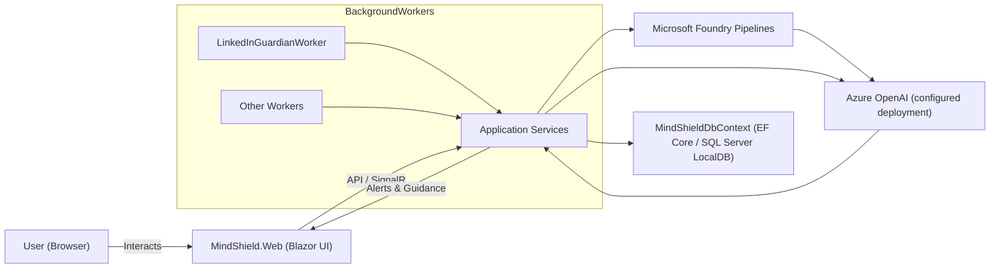

# MindShield: Professional Reputation Guardian

MindShield is an AI-driven safety net for social media, built for the **Microsoft Innovation Studio Hackathon**. It acts as an intelligent "pause button" to ensure your digital footprint always reflects your best professional self.

## 🚀 Key Features

* **Tiered Risk Analysis:** Uses **Microsoft Semantic Kernel** to categorize draft content into three distinct levels:
    * **Safe:** Professional or harmless casual updates.
    * **Moderate:** Unprofessional, aggressive, or "cringe" content.
    * **Severe:** Dangerous, delusional, or high-risk identity claims (e.g., impersonation).
* **Smart Intervention Logic:**
    * **For Moderate Risk:** The AI suggests a polite, professional **Rewrite** to fix the tone while keeping the user's intent.
    * **For Severe Risk:** The system **BLOCKS** the post entirely and triggers a **Guardian Notification** to a trusted contact (e.g., family member or mentor).
* **Hybrid AI Architecture:** Powered by **Azure AI Foundry (GPT-4o)** for primary high-fidelity analysis, with an optional **Ollama (Phi-3)** fallback for privacy-first offline usage.
* **Modern Dashboard:** A high-performance **Blazor Interactive Server** UI featuring Glassmorphism design and real-time scanning states.

## 🏗️ Architecture

The application hosts a Blazor front-end and an application service layer in the same process. Services call **Microsoft Foundry pipelines** that orchestrate Azure OpenAI model invocations and deterministic rules. Outcomes are stored in a SQL database and surfaced in the UI.


**Team**
- Kavya Aakaveeti — .net developer : architecture, Microsoft Foundry integration, and Azure OpenAI orchestration.

Setup (Developer)

Prerequisites
- .NET 10 SDK
- SQL Server LocalDB (or any SQL Server instance)
- Azure OpenAI access (endpoint, key, and a deployment name)
- (Optional) Microsoft Foundry access for running and versioning pipelines

Local setup
1. Clone the repository and open a terminal at the solution root.
2. Configure Azure OpenAI
   - Edit `MindShield/MindShield.Web/appsettings.json` and set `AzureOpenAI:Endpoint`, `AzureOpenAI:ApiKey`, and `AzureOpenAI:DeploymentName`.
   - Prefer environment variables or `dotnet user-secrets` for secrets in development. Use Key Vault for production.
3. Verify database connection
   - Ensure `ConnectionStrings:DefaultConnection` points to a reachable SQL instance.
4. Apply EF Core migrations (if included)

```bash
cd MindShield/MindShield.Web
dotnet ef database update
```

5. Run the application

```bash
dotnet run --project MindShield/MindShield.Web
```

6. Open the app in a browser at the URL printed by the host (typically `https://localhost:5xxx`). Background workers run inside the host and will log scanning activity.

Notes
- The project is configured to use Azure OpenAI exclusively. Remove or disable local LLM integrations if present.
- Keep API keys out of source control. Use environment variables, user-secrets, or Key Vault.

License & Contribution
- This repository is a hackathon demo. Contributions are welcome; please avoid committing sensitive credentials.
