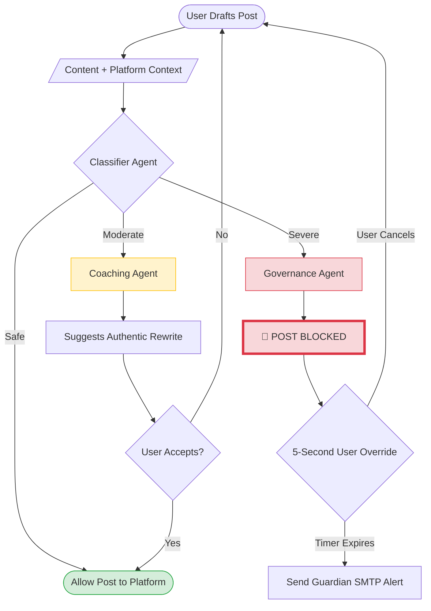

# MindShield: Professional Reputation Guardian 🛡️

**MindShield** is an AI-driven safety net for social media, built for the **Microsoft AI Dev Days Hackathon**. Powered by the **Microsoft Agent Framework**, **Microsoft Foundry**, and developed using **GitHub Copilot**.

---

## 💡 The Idea

Every developer knows this feeling — you're about to commit code and you run a quick diff first. Just a pause. A preview. A chance to make sure what you're pushing actually reflects your best work.

We do the same thing on social media every single day — except there's no diff. No preview. No pause button.

**MindShield is that pause button.**

Just as `git diff` shows you what you're about to push to a repository, MindShield shows you what you're about to push to the internet — before it's permanent.

| Git World | MindShield World |
| :--- | :--- |
| `git diff` before commit | AI safety scan before posting |
| Push to remote | Publish to social media |
| CI/CD pipeline checks | Multi-agent safety pipeline |
| Can't easily undo a bad push | Can't unsee a viral screenshot |

---

## 🎯 The Problem

We live in an era of digital permanence. A thoughtless tweet. An angry comment. A cringe-worthy post. These moments — seconds to create, instantly public — can shape careers, damage relationships, and define reputations for years.

MindShield solves this. It's the **pause button you wish you always had.**

**⏱️ Why Now?**

Three converging trends make MindShield especially relevant today:

+ **Digital Permanence Despite Deletion**: While users can delete social media posts, the internet rarely forgets. Content can be screenshotted, archived, or reshared within seconds. In many cases, the reputational damage happens before the original post is removed, making prevention more valuable than cleanup.
+ **The Agentic AI Breakthrough**: Traditional moderation tools relied on simple keyword filters that often missed context. Today, using the **Microsoft Agent Framework**, we can orchestrate specialized AI agents that understand nuance, tone, sarcasm, and platform-specific expectations.
+ **Corporate Compliance Pressure**: Organizations face increasing reputational and regulatory risks tied to employee social media activity. Companies need proactive, immutable audit trails to prevent brand-damaging posts before they happen.

---

## 🔒 Privacy & Trust

**Is this corporate spyware?**
No. MindShield is an **active seatbelt, not a security camera.** It coaches the employee and prevents fireable offenses before they happen — protecting the user's career just as much as the company's brand. There is no silent monitoring, no passive logging, and **no action without the user's knowledge.** Every intervention is visible, every decision is explainable, and the user retains full override control at all times.

**MindShield does not suppress free speech.** It only intervenes when a post carries genuine legal, personal, or career consequences the user themselves would regret — an SEC violation, a named personal attack, or a mental health crisis. General opinions, frustrations, and criticism pass through untouched. The goal is to let 95% of posts through and catch the 5% that could genuinely ruin someone's life.

**Where does the data go?**

+ **Draft content is never stored by default.** What you type stays between you and the AI analysis — it is never persisted to the database.
+ **Only risk metadata is saved**: platform, risk classification, AI confidence score, and intervention action. Never the raw post content.
+ **Guardian email alerts are entirely user-configured.** MindShield has no default surveillance. You choose your guardian, and you can cancel any alert within the 5-second override window.
+ **Offline privacy mode**: MindShield's **Ollama/Phi-3 fallback** runs semantic analysis entirely on local hardware, making it viable for **air-gapped enterprise environments** and privacy-first deployments.

*These principles are enforced by design, not just policy.*

---

## ✨ What Makes MindShield Different: A Multi-Agent Architecture

MindShield doesn't just pass text to a single LLM. It orchestrates three highly specialized agents to evaluate intent, preserve authenticity, and trigger interventions:

### 🤖 Agentic Tiered Analysis

+ **The Classifier Agent (Context & Routing)**: Evaluates risk differently for LinkedIn, X/Twitter, Instagram, and TikTok. It understands that a "hot take" acceptable on X might be career suicide on LinkedIn. Crucially, it distinguishes general enthusiasm from genuine legal violations — a keyword filter cannot do this.

+ **The Coaching Agent (Anti-Robot Rewrites)**: Engages during "Moderate" risks. It suggests professional rewrites that preserve the user's authentic voice and frustration, stripping out the fireable offenses without sounding like a corporate robot.

+ **The Governance Agent (Crisis & Compliance)**: Engages during "Severe" risks (e.g., Insider Trading or mental health crisis). It completely blocks the post and triggers a secure email alert to a user-designated Guardian.

---

## 🚀 Key Features

* **Real-Time Agent Trace Panel**: MindShield is a "glass box," not a black box. The UI features a live terminal streaming the multi-agent handoffs in real-time, proving exactly how the AI made its decision.
* **⏳ 5-Second "Break Glass" Intervention**: When Severe risk is detected, the UI locks down and initiates a 5-second countdown before notifying compliance or family — giving the user a final chance to cancel and regain control. **No action ever happens without the user's knowledge.**
* **🧠 Hybrid AI Architecture**: Powered by Azure AI Foundry (GPT-4o) for high-fidelity analysis, with Ollama (Phi-3) fallback support for privacy-first, fully offline, air-gapped enterprise usage.
* **💻 Glassmorphism Dashboard**: A high-performance Blazor Interactive Server UI featuring real-time scanning states and a modern, adaptive design.

---

## 📊 Real-World Impact

🟢 **Scenario 1: The "Hype" False Positive**

+ **User Types**: "My company's stock is about to go through the roof 🚀"
+ **Agent Decision**: **SAFE**. The Classifier Agent recognizes this as standard marketing enthusiasm, not an SEC violation — proving semantic intelligence over basic keyword matching. A keyword filter would block this. MindShield does not.

🟡 **Scenario 2: Platform-Aware Intelligence**

+ **User Types**: "My boss is so annoying, I can't stand this job" (Target: LinkedIn)
+ **Agent Decision**: **MODERATE**.
+ **Action**: The Coaching Agent kicks in and offers a rewrite: *"This job is so frustrating sometimes, and it feels like I'm constantly hitting roadblocks."* The user's frustration is validated, but the personal attack is removed.
+ **Switch to TikTok**: The exact same post returns **SAFE** — because venting is culturally acceptable on casual platforms.

🚨 **Scenario 3: The Crisis Override**

+ **User Types**: "Can't do this anymore. Done with everything."
+ **Agent Decision**: **SEVERE**.
+ **Action**: Bypasses all platform context. The 5-second countdown initiates. The Governance Agent sends a secure check-in alert to the user's designated emergency contact. The user retains full cancel control throughout.

---

### 📸 MindShield in Action

**Scenario 1: Safe — Platform-Aware Intelligence**


**Scenario 2: Platform Context (Same Text, Different Result)**


**Scenario 2: The Career Coach (Moderate Risk Rewrite)**


After clicking "Use Suggested Rewrite":


**Scenario 3: The Governance Agent (Severe Risk)**


**The Guardian Email Alert:**


---

## 🏗️ Technical Stack (AI Dev Days Hero Tech)

| Category | Technology |
| :--- | :--- |
| **AI Orchestration** | **Microsoft Agent Framework** / **Microsoft Foundry** |
| **Development** | **GitHub Copilot Agent Mode** / Visual Studio |
| **Frontend** | Blazor / HTML / CSS |
| **Backend** | .NET 10 / C# |
| **Database & Cloud** | Azure SQL / Entity Framework Core / Azure App Service |

---

## 🏗️ Multi-Agent Flowchart


```mermaid
flowchart TD
    Start([User Drafts Post]) --> Input[/Content + Platform Context/]
    Input --> Classifier{Classifier Agent}

    Classifier -->|Safe| Publish([Allow Post to Platform])
    
    Classifier -->|Moderate| Coach[Coaching Agent]
    Coach --> Rewrite[Suggests Authentic Rewrite]
    Rewrite --> UserChoice{User Accepts?}
    UserChoice -->|Yes| Publish
    UserChoice -->|No| Start

    Classifier -->|Severe| Governor[Governance Agent]
    Governor --> Block[🚫 POST BLOCKED]
    Block --> Timer{5-Second User Override}
    Timer -->|User Cancels| Start
    Timer -->|Timer Expires| Alert[Send Guardian SMTP Alert]

    style Publish fill:#d4edda,stroke:#28a745
    style Coach fill:#fff3cd,stroke:#ffc107
    style Governor fill:#f8d7da,stroke:#dc3545
    style Block fill:#f8d7da,stroke:#dc3545,stroke-width:4px
```

**Team**
+ **Kavya Aakaveeti** — .NET Developer: architecture, Microsoft Foundry integration, and Azure OpenAI orchestration.

---

## 🗄️ Data & Persistence Layer

MindShield uses SQL Server with Entity Framework Core to store structured, auditable outcomes. This transforms the app from a simple demo into a compliance-ready decision engine.

**What Is Persisted:**
+ Platform metadata & Risk classification
+ AI confidence score & Intervention action
+ Guardian notification status

> **Note:** Draft content is **never** permanently stored. Only anonymized risk metadata is persisted by default.

**Why Persistence Matters:**
+ **Enables audit trails** for corporate compliance.
+ **Supports regulatory documentation** for financial & legal sectors.
+ **Tracks behavioral risk trends** across an organization.
+ **Allows model evaluation** & threshold tuning.
+ **Supports enterprise reporting dashboards.**

---

## 💼 Enterprise Target Market

While MindShield acts as a personal safety net, its true value lies in Corporate Compliance and PR Risk Mitigation.

+ **Financial & Legal Sectors**: Protects professionals from accidentally posting SEC-violating claims or breaking client confidentiality.
+ **Corporate Social Media Managers**: Acts as an automated compliance officer to prevent brand-damaging posts from corporate accounts.
+ **High-Profile Executives**: Provides a necessary friction layer to prevent impulsive, late-night posts from impacting stock prices or public relations.

---

## 🗺️ Future Roadmap

📍 **Phase 1: Point-of-Creation Integration (UX)**
+ **Enterprise Browser Extension**: Packaging the .NET logic into a Chrome/Edge extension to passively evaluate text natively within linkedin.com or x.com text boxes.
+ **Mobile Keyboard API**: Developing an iOS/Android custom keyboard extension to intercept and evaluate content before it is submitted to any social application.

📍 **Phase 2: Enterprise Ecosystem Hooks (Extensibility)**
+ **Instant Chat Integrations**: Adding dependency-injected services for Microsoft Teams Alerts and Slack Webhooks.
+ **SMS Escalation**: Integrating Twilio SMS for immediate, high-priority SEC violation alerts (MNPI leaks).
+ **Role-Based Routing**: Routing "Moderate" coaching moments to HR, while instantly escalating "Severe" data leaks directly to SecOps.

📍 **Phase 3: Corporate RAG & Hyper-Personalization (AI)**
+ **Custom "Reality Profiles"**: Utilizing Azure AI Search (RAG) to ingest specific corporate employee handbooks, PR guidelines, and SEC compliance rules.
+ **Dynamic Agent Context**: Feeding localized RAG data directly into the Classifier Agent, replacing generalized LLM knowledge with company-specific enforcement.

---

## 🔒 Responsible AI Principles

MindShield is designed from the ground up with responsible AI at its core:

+ ✅ **Human override on all actions** — the 5-second cancel window ensures no autonomous action ever occurs.
+ ✅ **Transparent trace logs** — the glass-box terminal details exactly how every AI decision was made.
+ ✅ **No autonomous posting** — MindShield never posts on the user's behalf.
+ ✅ **Guardian alerts are user-configured** — no default surveillance. The user chooses their guardian.
+ ✅ **Draft content never stored** — only risk metadata is persisted. Your words stay yours.
+ ✅ **Privacy-first architecture** — fully offline processing available via Ollama/Phi-3 for air-gapped environments.
+ ✅ **Freedom of expression preserved** — MindShield passes through opinions, criticism, and frustration. It only intervenes when there is genuine legal or personal risk.

---

## 🛠️ Setup (Developer)

**Prerequisites**
+ .NET 10 SDK
+ SQL Server LocalDB (or any SQL Server instance)
+ Azure OpenAI access (endpoint, key, and deployment name)
+ (Optional) Ollama with Phi-3 for offline/local fallback

**Local Setup (Hybrid AI Support)**
MindShield is designed to run either on the cloud (Azure OpenAI) or completely offline (Ollama) depending on your configuration.

1. **Clone the repository** and open a terminal at the solution root.
2. **Configure the AI Brain (Choose Cloud or Local):**
   * **Option A (Azure OpenAI - Primary):** Edit `MindShield/MindShield.Web/appsettings.json` and set `AzureOpenAI:Endpoint`, `AzureOpenAI:ApiKey`, and `AzureOpenAI:DeploymentName`.
   * **Option B (Ollama - Offline Fallback):** Leave the Azure keys blank. Ensure you have Ollama installed and running locally with the Phi-3 model pulled (`ollama run phi3`). The app will automatically route requests to `localhost:11434`.
3. **Verify database connection:**
   - Ensure `ConnectionStrings:DefaultConnection` points to a reachable SQL instance.
4. **Configure Guardian Email (SMTP):**
   ```bash
   cd MindShield/MindShield.Web
   dotnet user-secrets init
   dotnet user-secrets set "Email:Sender" "your-gmail@gmail.com"
   dotnet user-secrets set "Email:AppPassword" "your-16-character-app-password"
   ```
5. **Apply EF Core Migrations:**
   ```bash
   dotnet ef database update
   ```
6. **Run the application:**
   ```bash
   dotnet run
   ```
7. **View the app**: Open a browser at the URL printed by the host (typically `https://localhost:5xxx`).

---

## 📝 Notes & License

**Notes:** Ensure your API keys are kept out of source control. Use environment variables, user-secrets, or Azure Key Vault for cloud deployments.

**License & Contribution:** This repository is a hackathon demo. Contributions are welcome; please avoid committing sensitive credentials.

---

## 🧠 A New Category of Technology

> *"Just as developers run `git diff` before every commit — MindShield gives you that same pause, that same preview, before anything you post reaches the internet permanently."*

**MindShield introduces: AI Reputation Infrastructure.**
