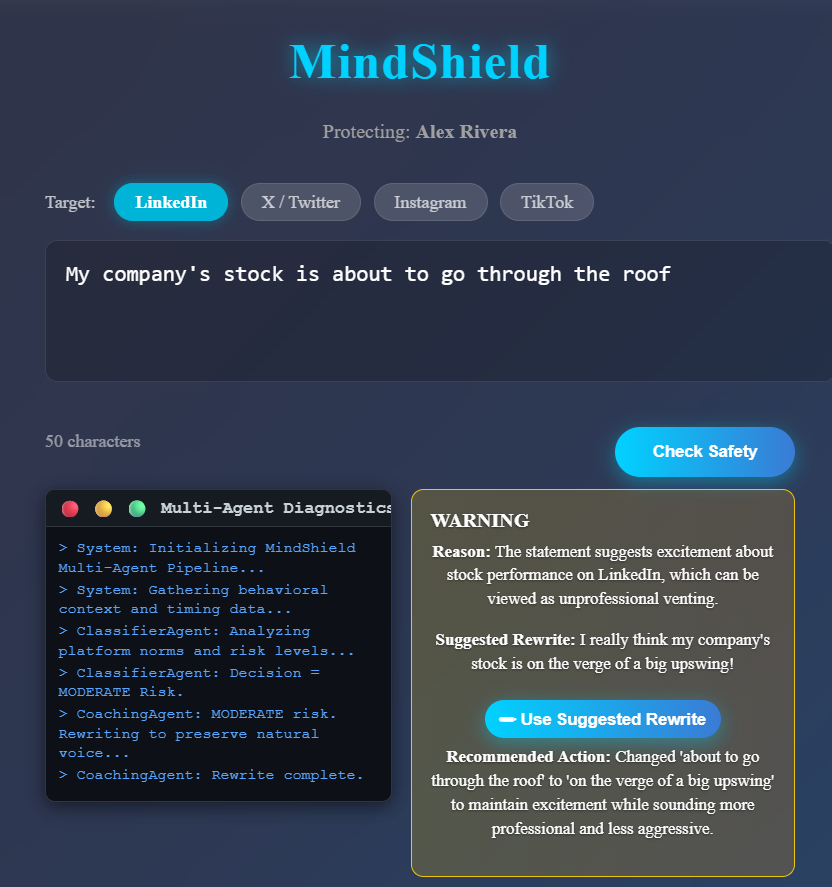
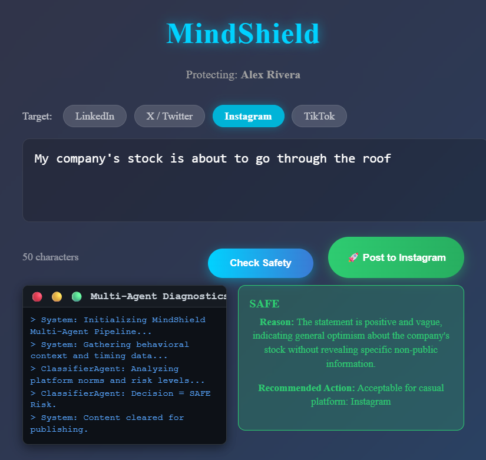

# MindShield: Professional Reputation Guardian 🛡️

**MindShield** is an AI-driven safety net for social media, built for the **Microsoft AI Dev Days Hackathon**. Powered by the **Microsoft Agent Framework**, **Microsoft Foundry**, and developed using **GitHub Copilot**, it acts as an intelligent "pause button" to ensure your digital footprint always reflects your best professional self.

## 🎯 The Problem

We live in an era of digital permanence. A thoughtless tweet. An angry comment. A cringe-worthy post. These moments—seconds to create, instantly public—can shape careers, damage relationships, and define reputations for years.

MindShield solves this. It's the **pause button** you wish you always had.

**⏱️ Why Now?**

Three converging trends make MindShield especially relevant today:

+ **Digital Permanence Despite Deletion**: While users can delete social media posts, the internet rarely forgets. Content can be screenshotted, archived, or reshared within seconds. In many cases, the reputational damage happens before the original post is removed, making prevention more valuable than cleanup.
+ **The Agentic AI Breakthrough:** Traditional moderation tools relied on simple keyword filters that often missed context. Today, using the **Microsoft Agent Framework**, we can orchestrate specialized AI agents that understand nuance, tone, sarcasm, and platform-specific expectations..
+ **Corporate Compliance Pressure** :Organizations face increasing reputational and regulatory risks tied to employee social media activity. Companies need proactive, immutable audit trails to prevent brand-damaging posts before they happen.

## ✨ What Makes MindShield Different: A Multi-Agent Architecture
MindShield doesn't just pass text to a single LLM. It orchestrates three highly specialized agents to evaluate intent, preserve authenticity, and trigger interventions:

### 🤖 Agentic Tiered Analysis

+ **The Classifier Agent (Context & Routing)**: Evaluates risk differently for LinkedIn, X/Twitter, Instagram, and TikTok. It understands that a "hot take" acceptable on X might be career suicide on LinkedIn.

+ **The Coaching Agent (Anti-Robot Rewrites)**: Engages during "Moderate" risks. It suggests professional rewrites that preserve the user’s authentic voice and frustration, stripping out the fireable offenses without sounding like a corporate robot.

+ **The Governance Agent (Crisis & Compliance)**: Engages during "Severe" risks (e.g., Insider Trading or self-harm). It completely blocks the post and triggers a secure email alert to a user-designated Guardian.

## 🚀 Key Features

* **Real-Time Agent Trace Panel**: MindShield is a "glass box," not a black box. The UI features a live terminal streaming the multi-agent handoffs in real-time, proving exactly how the AI made its decision
* ⏳**5-Second "Break Glass" Intervention**: When Severe risk is detected, the UI locks down and initiates a 5-second countdown before notifying compliance or family, giving the user a final chance to cancel and regain control
* **🧠 Hybrid AI Architecture:** Powered by Azure AI Foundry (GPT-4o) for high-fidelity analysis, with Ollama (Phi-3) fallback support for privacy-first offline usage.
* **💻 Glassmorphism Dashboard:** A high-performance Blazor Interactive Server UI featuring real-time scanning states and a modern, adaptive design.

## 📊 Real-World Impact

🟢 **Scenario 1: The "Hype" False Positive**

+ **User Types**: "My company's stock is about to go through the roof 🚀"

+ **Agent Decision**: **SAFE**. The Classifier Agent recognizes this as standard marketing hype, not an SEC violation, proving semantic intelligence over basic keyword matching.

🟡 **Scenario 2: The Authentic Coach**

+ **User Types**: "Just sat through another meeting where my boss took credit for my work." (Target: LinkedIn)
+ **Agent Decision**: **MODERATE**.
+ **Action**: The Coaching Agent kicks in and offers a rewrite: "Just wrapped another meeting where it felt like my contributions got brushed aside. Keeping a smile, but man, it's tough." The user's frustration is validated, but the public attack is removed.

🚨 **Scenario 3: The Crisis Override**

**User Types:** "Can't do this anymore. Done with everything."

**Agent Decision**: **SEVERE**.

+ **Action**: Bypasses all platform context. The 5-second countdown initiates. The Governance Agent sends a secure check-in alert to the user's designated emergency contact (e.g., Wife).
  
### 📸 MindShield in Action

**Scenario 1: Platform-Aware Intelligence**



**The Career Coach (Moderate Risk):**

After Click on Use Suggested Rewrite


**Scenario 3: The Governance Agent (Severe Risk)**


**The Guardian Protocol:**


## 🏗️ Technical Stack (AI Dev Days Hero Tech)

| Category | Technology |
| :--- | :--- |
| **AI Orchestration** | **Microsoft Agent Framework** / **Microsoft Foundry** |
| **Development** | **GitHub Copilot Agent Mode** / Visual Studio |
| **Frontend** | Blazor / HTML / CSS |
| **Backend** | .NET 10 / C# |
| **Database & Cloud** | Azure SQL / Entity Framework Core / Azure App Service ready |

## 🏗️ Multi-Agent Flowchart


```mermaid
flowchart TD
    Start([User Drafts Post]) --> Input[/Content + Platform Context/]
    Input --> Classifier{Classifier Agent}

    Classifier -->|Safe| Publish([Allow Post to Platform])
    
    Classifier -->|Moderate| Coach[Coaching Agent]
    Coach --> Rewrite[Suggests Authentic Rewrite]
    Rewrite --> UserChoice{User Accepts?}
    UserChoice -->|Yes| Publish
    UserChoice -->|No| Start

    Classifier -->|Severe| Governor[Governance Agent]
    Governor --> Block[🚫 POST BLOCKED]
    Block --> Timer{5-Second User Override}
    Timer -->|User Cancels| Start
    Timer -->|Timer Expires| Alert[Send Guardian SMTP Alert]

    style Publish fill:#d4edda,stroke:#28a745
    style Coach fill:#fff3cd,stroke:#ffc107
    style Governor fill:#f8d7da,stroke:#dc3545
    style Block fill:#f8d7da,stroke:#dc3545,stroke-width:4px
```
**Team** <br>
+ **Kavya Aakaveeti** — .net developer : architecture, Microsoft Foundry integration, and Azure OpenAI orchestration.

## 🗄️ Data & Persistence Layer
MindShield uses SQL Server with Entity Framework Core to store structured, auditable outcomes. This transforms the app from a simple demo into a compliance-ready decision engine. <br>
**What Is Persisted:**
+ Platform metadata & Risk classification<br>
+ AI confidence score & Intervention action<br>
+ Guardian notification status<br>

Note: By default, draft content is not permanently stored. Optional redacted or hashed excerpts may be logged strictly in enterprise compliance modes.

**Why Persistence Matters**
+ The database layer transforms MindShield from a demo into a compliance-ready decision engine:
+ **Enables audit trails** for corporate compliance.
+ **Supports regulatory documentation** for financial & legal sectors
+ **Tracks behavioral risk trends** across an organization.
+ **Allows model evaluation** & threshold tuning.
+ **Supports enterprise reporting dashboards**

## 💼 Enterprise Target Market
  While MindShield acts as a personal safety net, its true value lies in Corporate Compliance and PR Risk Mitigation.
  
  + **Financial & Legal Sectors**: Protects professionals from accidentally posting SEC-violating claims or breaking client confidentiality.<br>
  + **Corporate Social Media Managers**: Acts as an automated compliance officer to prevent brand-damaging posts from corporate accounts.<br>
  + **High-Profile Executives**: Provides a necessary friction layer to prevent impulsive, late-night posts from impacting stock prices or public relations.

## 🗺️ Future Roadmap
The current hackathon build successfully proves the viability of a Multi-Agent risk-routing engine. To scale MindShield into a ubiquitous enterprise safety net, the development roadmap is structured into three strategic phases:

📍 **Phase 1: Point-of-Creation Integration (UX)**
Currently, MindShield operates as a standalone dashboard. The next step is frictionless, invisible integration where the user already works.
  + **Enterprise Browser Extension**: Packaging the .NET logic into a Chrome/Edge extension to passively evaluate text natively within linkedin.com or x.com text boxes.
  + **Mobile Keyboard API**: Developing an iOS/Android custom keyboard extension to intercept and evaluate content before it is submitted to any social application.

📍 **Phase 2: Enterprise Ecosystem Hooks (Extensibility)**
The architecture currently utilizes an IGuardianNotificationService interface with an SMTP email implementation. Phase 2 expands this to fit modern corporate workflows.
  + **Instant Chat Integrations**: Adding dependency-injected services for Microsoft Teams Alerts and Slack Webhooks.
  + **SMS Escalation:** Integrating Twilio SMS for immediate, high-priority SEC violation alerts (MNPI leaks).
  + **Role-Based Routing:** Routing "Moderate" coaching moments to HR, while instantly escalating "Severe" data leaks directly to SecOps.

📍 **Phase 3: Corporate RAG & Hyper-Personalization (AI)**
Moving from general safety guidelines to company-specific compliance.
+ **Custom "Reality Profiles":** Utilizing Azure AI Search (RAG) to ingest specific corporate employee handbooks, PR guidelines, and SEC compliance rules.
+ **Dynamic Agent Context:** Feeding this localized RAG data directly into the Classifier Agent, allowing the AI to enforce Company A's specific NDA rules rather than relying solely on generalized LLM knowledge.

## 🔒Privacy & Responsible AI
+ MindShield is designed with responsible AI principles:
+ Human override on all actions (The 5-second cancel window).
+ Transparent trace logs detailing exactly how the AI made its decision.
+ No autonomous posting.
+ Guardian alerts are user-configured — **no default surveillance.**

## 🛠️ Setup (Developer)
**Prerequisites**
+ .NET 10 SDK<br>
+ SQL Server LocalDB (or any SQL Server instance)<br>
+ Azure OpenAI access (endpoint, key, and a deployment name)<br>
+ (Optional) Microsoft Foundry access for running and versioning pipelines.<br>

**Local Setup**

1. **Clone the repository** and open a terminal at the solution root.
2. **Configure Azure OpenAI:**
    * Edit MindShield/MindShield.Web/appsettings.json and set AzureOpenAI:Endpoint, AzureOpenAI:ApiKey, and AzureOpenAI:DeploymentName.    
    * Prefer environment variables or dotnet user-secrets for secrets in development. Use Key Vault for production.<br>
3.**Verify database connection:**
    * Ensure ConnectionStrings:DefaultConnection points to a reachable SQL instance.
4. **Configure Guardian Email (SMTP):** <br>
        cd MindShield/MindShield.Web  <br>
        dotnet user-secrets init <br>
        dotnet user-secrets set "Email:Sender" "your-gmail@gmail.com"  <br>
        dotnet user-secrets set "Email:AppPassword" "your-16-character-app-password"
   
6. **Apply EF Core Migrations & Update Database:**
   ```bash
    dotnet ef database update
   ```
7. **Run the application**:
   ```bash
   dotnet run
   ```
8.  **View the app**: Open a browser at the URL printed by the host (typically https://localhost:5xxx). Background workers run inside the host and will log scanning activity.

## 📝 Notes & License

**Notes:** The project is configured to use Azure OpenAI exclusively. Remove or disable local LLM integrations if present. Keep API keys out of source control. Use environment variables, user-secrets, or Key Vault.

**License & Contribution:** This repository is a hackathon demo. Contributions are welcome; please avoid committing sensitive credentials.

***🧠 A New Category***

MindShield introduces a new category of technology:

AI Reputation Infrastructure

Just as spam filters protect email and security software protects devices, MindShield protects digital identity and reputation before content reaches the internet.
