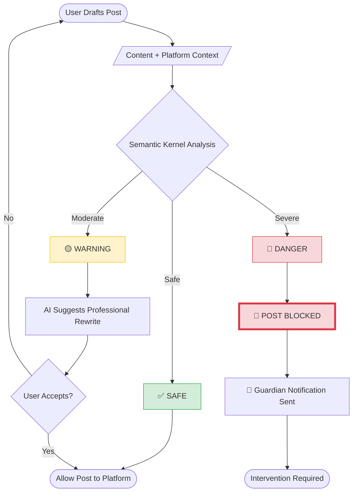

# MindShield: Professional Reputation Guardian 🛡️
**MindShield** is an AI-driven safety net for social media, built for the **Microsoft Innovation Studio Hackathon**. It acts as an intelligent "pause button" to ensure your digital footprint always reflects your best professional self.

**🎯 The Problem**<br>

We live in an era of digital permanence. A thoughtless tweet. An angry comment. A cringe-worthy post. These moments—seconds to create, instantly public—can shape careers, damage relationships, and define reputations for years.

MindShield solves this. It's the pause button you wish you always had

**✨ What Makes MindShield Different**

**🧠 Intelligent Tiered Analysis**
MindShield doesn't just flag keywords—it understands intent and platform nuances. Using **Microsoft Semantic Kernel** and **Azure OpenAI (GPT-4o)**, it categorizes content into three distinct risk levels:<br>

+ **Safe**: Professional or harmless casual updates.<br>
+ **Moderate**: Unprofessional, aggressive, or "cringe" content.<br>
+ **Severe**: Dangerous, delusional, or high-risk identity claims (e.g., impersonation).

## 🚀 Key Features

**Multi-Platform Context Engine**: Evaluates risk differently for LinkedIn, X/Twitter, Instagram, and TikTok. The AI understands that a "hot take" acceptable on X might be a reputation risk on LinkedIn.<br>

**Smart Intervention Logic**:  For Moderate Risk: The AI suggests a polite, professional **Rewrite** to fix the tone while preserving the user's core intent.<br>

**For Severe Risk**: The system BLOCKS the post entirely and triggers a **Guardian Notification**.

**Real-Time Guardian Alerts**: Integrated with SMTP/Email services, the system bypasses the user to send an immediate, high-priority HTML alert to a trusted contact (e.g., family or mentor) when severe risk is detected.

**Confidence Scoring:** Provides a transparency layer (e.g., 92% Confidence) for every assessment, surfacing the AI's certainty to the user.

**Hybrid AI Architecture**: Powered by Azure AI Foundry (GPT-4o) for high-fidelity analysis, with Ollama (Phi-3) fallback support for privacy-first offline usage.

**Glassmorphism Dashboard**: A high-performance Blazor Interactive Server UI featuring real-time scanning states and a modern, adaptive design.

  ## 📊 Real-World Impact

**Example 1**:

 + **User post**: "I have chip in my brain"
 + **Detection**: 🔴 SEVERE (Self-harm/delusional language)
 + **Action**: POST BLOCKED
 + **Guardian Alert**: Email sent to family member:

    >  Subject: 🚨 URGENT: MindShield Intervention Alert <br>
    >  "A severe risk social media post was intercepted and blocked by MindShield.<br>
    > **Flagged Reason** : High-risk delusional or self-harm language detected.<br>
    > **Intercepted Draft**: 'i have chip in my brain'<br>
    >  Please reach out to check in."

📱 **Platform-Aware Intelligence**
Same post, different platforms = different risk levels
**Post**: "I'm done with my job"

+ 💼 **LinkedIn**: 🔴 SEVERE (Career suicide on professional network)<br>
+ 𝕏 **Twitter**: 🟡 MODERATE (Venting is normal, but could go viral)<br>
+ 📸 **Instagram**: 🟢 SAFE (Personal account, venting is acceptable)<br>
+ 🎵 **TikTok**: 🟢 SAFE (Audience expects casual opinions)

## 🏗️ Technical Stack

| Category | Technology |
| :--- | :--- |
| **Frontend** | Blazor / HTML / CSS |
| **Backend** | .NET 10 / C# |
| **AI Orchestration** | Microsoft Semantic Kernel |
| **Database** | SQL Server / EF Core |


## 🏗️ Architecture

The application hosts a Blazor front-end and an application service layer in the same process. Services call **Microsoft Foundry pipelines** that orchestrate Azure OpenAI model invocations and deterministic rules. Outcomes are stored in a SQL database and surfaced in the UI.


```mermaid
flowchart TD
    Start([User Drafts Post]) --> Input[/Content + Platform Context/]
    Input --> SK{Semantic Kernel Analysis}

    SK -->|Safe| SafeResult[✅ SAFE]
    SK -->|Moderate| WarnResult[🟡 WARNING]
    SK -->|Severe| DangerResult[🔴 DANGER]

    SafeResult --> Publish([Allow Post to Platform])
    
    WarnResult --> Rewrite[AI Suggests Professional Rewrite]
    Rewrite --> UserChoice{User Accepts?}
    UserChoice -->|Yes| Publish
    UserChoice -->|No| Start

    DangerResult --> Block[🚫 POST BLOCKED]
    Block --> Alert[🚨 Guardian Notification Sent]
    Alert --> Support([Intervention Required])

    style SafeResult fill:#d4edda,stroke:#28a745
    style WarnResult fill:#fff3cd,stroke:#ffc107
    style DangerResult fill:#f8d7da,stroke:#dc3545
    style Block fill:#f8d7da,stroke:#dc3545,stroke-width:4px
```
**Team** <br>
+ **Kavya Aakaveeti** — .net developer : architecture, Microsoft Foundry integration, and Azure OpenAI orchestration.

# 💼 Enterprise Target Market
  While MindShield acts as a personal safety net, its true value lies in Corporate Compliance and PR Risk Mitigation.
  
  + **Financial & Legal Sectors**: Protects professionals from accidentally posting SEC-violating claims or breaking client confidentiality.<br>
  + **Corporate Social Media Managers**: Acts as an automated compliance officer to prevent brand-damaging posts from corporate accounts.<br>
  + **High-Profile Executives**: Provides a necessary friction layer to prevent impulsive, late-night posts from impacting stock prices or public relations.

# 🗺️ Future Roadmap
The current hackathon build proves the viability of the Semantic Kernel tiered-risk engine. The next phases of development focus on frictionless UX and enterprise integrations:
+ **Frictionless Interception (UX)**: Moving away from a standalone dashboard by packaging the .NET logic into a **Browser Extension** and a **Mobile Keyboard API.** This will allow MindShield to passively scan text boxes natively within the LinkedIn or X apps.<br>
+ **Notification Extensibility:** The architecture utilizes an IGuardianNotificationService interface. While the prototype uses SMTP Email, this dependency-injected design allows for rapid integrations with **Slack Webhooks, Microsoft Teams Alerts, or Twilio SMS** for instant corporate compliance alerts.<br>
+ **Custom "Reality Profiles"**: Allowing enterprise organizations to train the AI on their specific corporate guidelines and employee handbooks via Azure AI Search (RAG).

**Setup (Developer)**

**Prerequisites**
- .NET 10 SDK
- SQL Server LocalDB (or any SQL Server instance)
- Azure OpenAI access (endpoint, key, and a deployment name)
- (Optional) Microsoft Foundry access for running and versioning pipelines

Local setup
1. Clone the repository and open a terminal at the solution root.
2. **Configure Azure OpenAI**
   - Edit `MindShield/MindShield.Web/appsettings.json` and set `AzureOpenAI:Endpoint`, `AzureOpenAI:ApiKey`, and `AzureOpenAI:DeploymentName`.
   - Prefer environment variables or `dotnet user-secrets` for secrets in development. Use Key Vault for production.
3. **Verify database connection**
   - Ensure `ConnectionStrings:DefaultConnection` points to a reachable SQL instance.
4.  Apply EF Core Migrations & Run:
5.  Open the app in a browser at the URL printed by the host (typically https://localhost:5xxx). Background workers run inside the host and will log scanning activity. <br>

**🔒 Privacy & Security**
+ ✅ Your drafts are never permanently stored <br>
+ ✅ Guardian contacts are your choice—no default surveillance<br>
+ ✅ Fallback to offline Ollama for privacy-sensitive use<br>

**Notes**
+ The project is configured to use Azure OpenAI exclusively. Remove or disable local LLM integrations if present.<br>

+ Keep API keys out of source control. Use environment variables, user-secrets, or Key Vault.

**Configure Guardian Email** (SMTP):<br>
dotnet user-secrets set "Email:Sender" "your-gmail@gmail.com"<br>
dotnet user-secrets set "Email:AppPassword" "your-16-character-app-password"

```bash
cd MindShield/MindShield.Web
dotnet ef database update
```

5. Run the application

```bash
dotnet run --project MindShield/MindShield.Web
```

**License & Contribution**
- This repository is a hackathon demo. Contributions are welcome; please avoid committing sensitive credentials.
