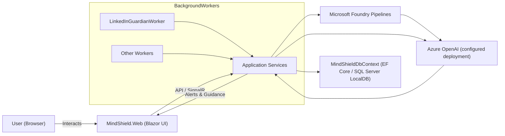

# MindShield: Professional Reputation Guardian
MindShield 🛡️
MindShield is an AI-driven safety net for social media, built for the **Microsoft Innovation Studio Hackathon**. It acts as an intelligent "pause button" to ensure your digital footprint always reflects your best professional self.

🎯 The Problem

We live in an era of digital permanence. A thoughtless tweet. An angry comment. A cringe-worthy post. These moments—seconds to create, instantly public—can shape careers, damage relationships, and define reputations for years.

MindShield solves this. It's the pause button you wish you always had.

✨ What Makes MindShield Different

🧠 Intelligent Tiered Analysis
MindShield doesn't just flag content—it understands intent. Using Microsoft Semantic Kernel and Azure OpenAI (GPT-4o), it categorizes draft posts into three risk levels.

## 🚀 Key Features

* **Tiered Risk Analysis:** Uses **Microsoft Semantic Kernel** to categorize draft content into three distinct levels:
    * **Safe:** Professional or harmless casual updates.
    * **Moderate:** Unprofessional, aggressive, or "cringe" content.
    * **Severe:** Dangerous, delusional, or high-risk identity claims (e.g., impersonation).
* **Smart Intervention Logic:**
    * **For Moderate Risk:** The AI suggests a polite, professional **Rewrite** to fix the tone while keeping the user's intent.
    * **For Severe Risk:** The system **BLOCKS** the post entirely and triggers a **Guardian Notification** to a trusted contact (e.g., family member or mentor).
* **Hybrid AI Architecture:** Powered by **Azure AI Foundry (GPT-4o)** for primary high-fidelity analysis, with an optional **Ollama (Phi-3)** fallback for privacy-first offline usage.
* **Modern Dashboard:** A high-performance **Blazor Interactive Server** UI featuring Glassmorphism design and real-time scanning states.

  📊 Real-World Impact

  Example 1:

  User: "My boss is the worst. I'm so done with this company. 
        Time to tell everyone on LinkedIn what I really think."

MindShield: 🟡 Moderate Risk
Reasoning: Post expresses frustration professionally but could damage career
Rewrite: "Grateful for the growth here, but excited for new opportunities 
         that better align with my values. Open to conversations!"

Example 2:

User: "I'm leaving town tomorrow. Everyone should know who I really am.
       My real name is [celebrity], and I've been hiding my true identity."

MindShield: 🔴 Severe Risk
Action: POST BLOCKED
Guardian Alert: Trusted contact notified (message: "User attempting 
                high-risk identity claim. Please check in.")

Example 3: Safe Content

Input: "Excited to announce I've been promoted to Senior Engineer! 
        Grateful for my amazing team and mentors who got me here. 🚀"

Output: ✅ SAFE
Confidence: 98%
Reason: Professional announcement expressing appropriate gratitude

## 🏗️ Architecture

The application hosts a Blazor front-end and an application service layer in the same process. Services call **Microsoft Foundry pipelines** that orchestrate Azure OpenAI model invocations and deterministic rules. Outcomes are stored in a SQL database and surfaced in the UI.


```mermaid
flowchart LR
    User["User (Browser)"] -->|Interacts| UI["MindShield.Web (Blazor UI)"]
    UI -->|API / SignalR| Services["Application Services"]
    Services --> Foundry["Microsoft Foundry Pipelines"]
    Services --> OpenAI["Azure OpenAI (configured deployment)"]
    Services --> DB["MindShieldDbContext (EF Core / SQL Server LocalDB)"]
    Foundry --> OpenAI
    OpenAI --> Services
    subgraph BackgroundWorkers
        LinkedIn["LinkedInGuardianWorker"]
        Other["Other Workers"]
        LinkedIn --> Services
        Other --> Services
    end
    Services -->|Alerts & Guidance| UI
```
**Team**
- Kavya Aakaveeti — .net developer : architecture, Microsoft Foundry integration, and Azure OpenAI orchestration.

Setup (Developer)

Prerequisites
- .NET 10 SDK
- SQL Server LocalDB (or any SQL Server instance)
- Azure OpenAI access (endpoint, key, and a deployment name)
- (Optional) Microsoft Foundry access for running and versioning pipelines

Local setup
1. Clone the repository and open a terminal at the solution root.
2. Configure Azure OpenAI
   - Edit `MindShield/MindShield.Web/appsettings.json` and set `AzureOpenAI:Endpoint`, `AzureOpenAI:ApiKey`, and `AzureOpenAI:DeploymentName`.
   - Prefer environment variables or `dotnet user-secrets` for secrets in development. Use Key Vault for production.
3. Verify database connection
   - Ensure `ConnectionStrings:DefaultConnection` points to a reachable SQL instance.
4. Apply EF Core migrations (if included)

```bash
cd MindShield/MindShield.Web
dotnet ef database update
```

5. Run the application

```bash
dotnet run --project MindShield/MindShield.Web
```

6. Open the app in a browser at the URL printed by the host (typically `https://localhost:5xxx`). Background workers run inside the host and will log scanning activity.

Notes
- The project is configured to use Azure OpenAI exclusively. Remove or disable local LLM integrations if present.
- Keep API keys out of source control. Use environment variables, user-secrets, or Key Vault.

License & Contribution
- This repository is a hackathon demo. Contributions are welcome; please avoid committing sensitive credentials.
